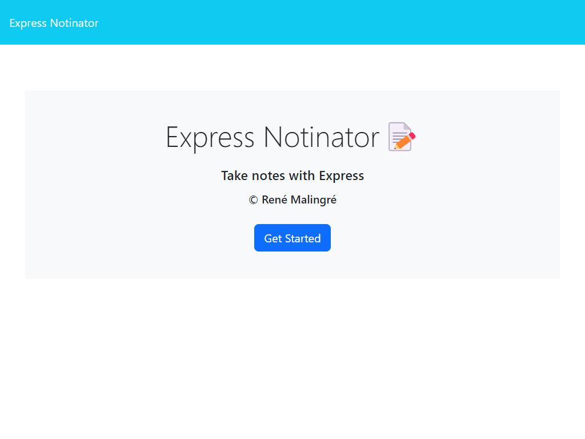
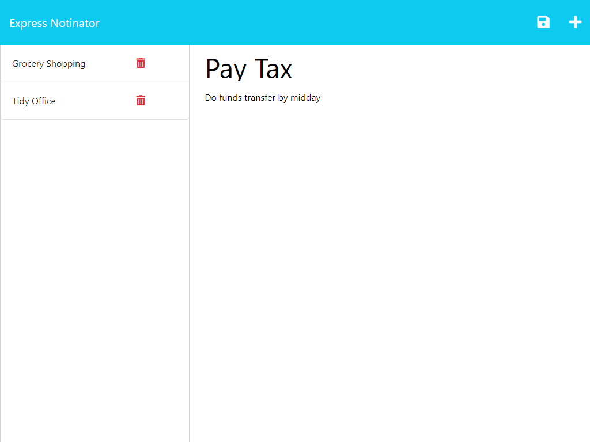
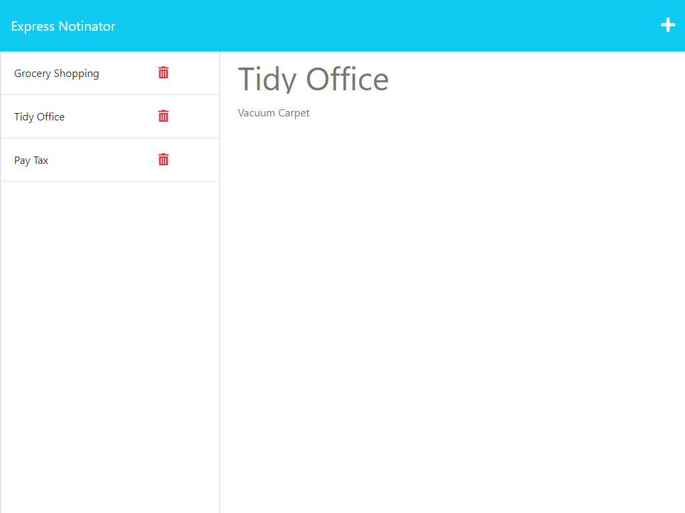

# Express Notinator

 [](https://opensource.org/licenses/MIT)

## Description

This is a simple note-taking application that can be used to write and save notes.  It uses an Express.js back end and saves and retrieves note data from a JSON file.

## Table of Contents

- [Technologies Used](#technologies-used)
- [Installation](#installation)
- [Usage](#usage)
- [Screenshot](#screenshot)
- [License](#license)
- [Contributing](#contributing)
- [Questions](#questions)

## Technologies Used

- HTML, CSS
- JavaScript
- Node.js
- Express.js
- uuid npm package
  
## Installation
  
Fork or copy the repository to your own machine. To install the necessary dependencies, run the following command in the terminal:
  
```bash
npm i
```

## Usage

 To run the app in the development environment, open the terminal and navigate to the directory where you copied the repository.  Run the following command:

```bash
node server.js
```

Navigate to [localhost:3001](http://localhost:3001/) in your browser to view the application.

Alternatively, the application is deployed temporarily on Heroku at [express-notinator.herokuapp.com](https://express-notinator.herokuapp.com).

The first page will display a button that links to the notes page.  Click on this to navigate to the notes page.

The notes page will display any notes that have been saved as a list on the left of the page. To add a new note, click on the plus icon in the top right hand corner.  This will display a blank note form with light blue placeholder text. Enter a title and text for the note, then click on the save icon in the top right corner.  The note will be saved and displayed in the left-hand column.  Click on a saved note to display it in the main area. To delete a note, click on the rubbish bin icon next to the note.

Please note that all users share the same notes, so be careful not to delete notes that you did not create and avoid using any sensitive information in your notes. The notes are stored in a JSON file, so they will persist even if the server is stopped and restarted, but according to Heroku's documentation, the file system is ephemeral, so the notes may be lost from time to time.

## Screenshot

Screenshot of the front page of the application:



Screenshot of adding a new note, showing the save icon:



Screenshot of reviewing an existing note:



## License
  
This repository is licensed under the [MIT](https://opensource.org/licenses/MIT) license.
  
## Contributing
  
Contributions to this project will not be accepted, as this project is an assessment piece for a coding course, and it must be the project author's own work. However, feel free to fork the repository and make your own changes.
  
## Questions
  
If you have any questions about the repository, open an issue or contact me directly at:
[rene.malingre@gmail.com](mailto:rene.malingre@gmail.com).
  
You can find more of my work at [GitHub](https://github.com/ReneMalingre).

## Credits

Starter Code forked from [coding-boot-camp/miniature-eureka](https://github.com/coding-boot-camp/miniature-eureka) repository.

JavaScript runtime: [Node.js](https://nodejs.org/en/)

Web framework: [Express.js](https://expressjs.com/)

Unique ID generator: [uuid npm package](https://www.npmjs.com/package/uuid)

Hosting: [Heroku](https://www.heroku.com/)
